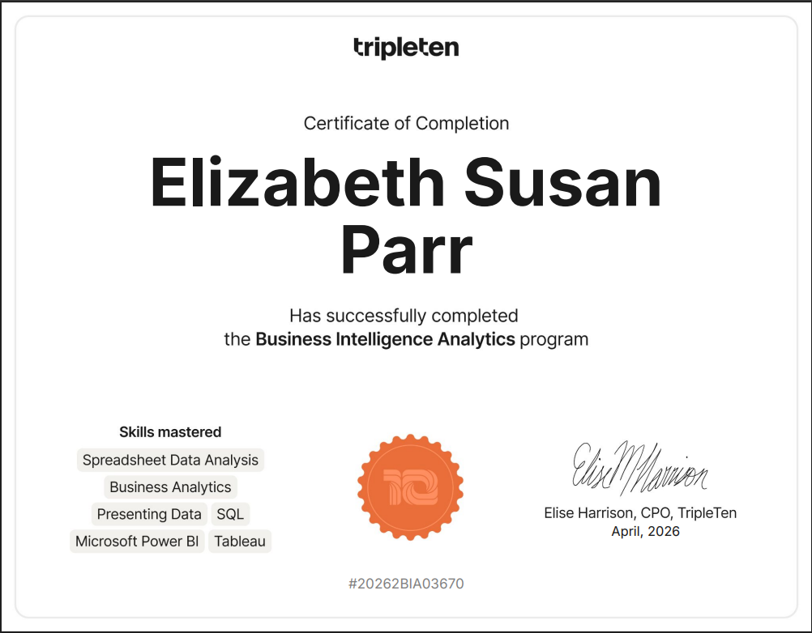

# Hi, I’m Lizz 👋

I’m a Data Analyst with a background in tech support and operations, transitioning into business intelligence and analytics with 4+ years of experience improving workflows, solving operational problems, and delivering actionable insights.

---

## 🔍 What I Do
- Turn messy data into clear, actionable insights  
- Build dashboards in Tableau and Power BI  
- Analyze trends and KPIs to support data-driven decisions

---

## 🎓 Certification
### TripleTen — Business Intelligence Analytics Certificate (2026)

  

---

## ⚙️ Tech Stack
- Analytics: SQL, Excel, Google Sheets
- Visualization: Tableau, Power BI
- BI Skills: DAX, KPI Reporting, Dashboard Design
- Data Work: Data Cleaning, Data Visualization

---

## 📊 Featured Projects

<table align="center">
<tr>

<td align="center" width="50%">

<h4>
  <a href="https://github.com/ElizabethParr/superstore-tableau-analysis">
    📈 Superstore Profitability Analysis
  </a>
</h4>

 
Tableau • Profitability Analysis

</td>

<td align="center" width="50%">

<h4>
  <a href="https://github.com/ElizabethParr/return-rate-monitoring-dashboard">
    🔄 Return Rate Monitoring Dashboard
  </a>
</h4>

 
Tableau • Return Rate Analysis

</td>

</tr>
</table>

 

<table align="center">
<tr>

<td align="center" width="50%">

<h4>
  <a href="https://github.com/ElizabethParr/ecommerce-conversion-retention-analysis">
    🛒 E-commerce Conversion Funnel
  </a>
</h4>

 
Google Sheets • Funnel & Cohort Analysis

</td>

<td align="center" width="50%">

<h4>
  <a href="https://github.com/ElizabethParr/app-reviews-powerbi-analysis">
    📱 App Reviews Analysis
  </a>
</h4>

 
Power BI • Review & Engagement Analysis

</td>

</tr>
</table>

---

## 💼 Open To
I’m seeking entry-level Data Analyst or Business Intelligence roles, as well as project-based opportunities involving dashboards, reporting, and process improvement.

---

## 🌎 Location
Wisconsin, USA | Open to remote opportunities  

---

## 🔗 Links
- [LinkedIn](https://www.linkedin.com/in/lizz-parr/)  
- [GitHub Portfolio](https://github.com/ElizabethParr)
- [Tableau Public](https://public.tableau.com/app/profile/elizabeth.parr2046/vizzes)
- [Resume](https://docs.google.com/document/d/1GWhXvIHpbuZXLe9YjpeBX4HqUdBkULt16rMakiA4Mv0/edit?usp=sharing)
---

## ✨ A Little About Me
- I enjoy solving complex problems and optimizing workflows  
- I learn best by building real-world projects  
- My background in tech support and operations gave me experience working with KPI reporting and dashboards from the business-user side  
- I enjoy collaborating across teams and translating technical information into clear, actionable insights  
- I’m continually growing my skills in business intelligence and analytics
